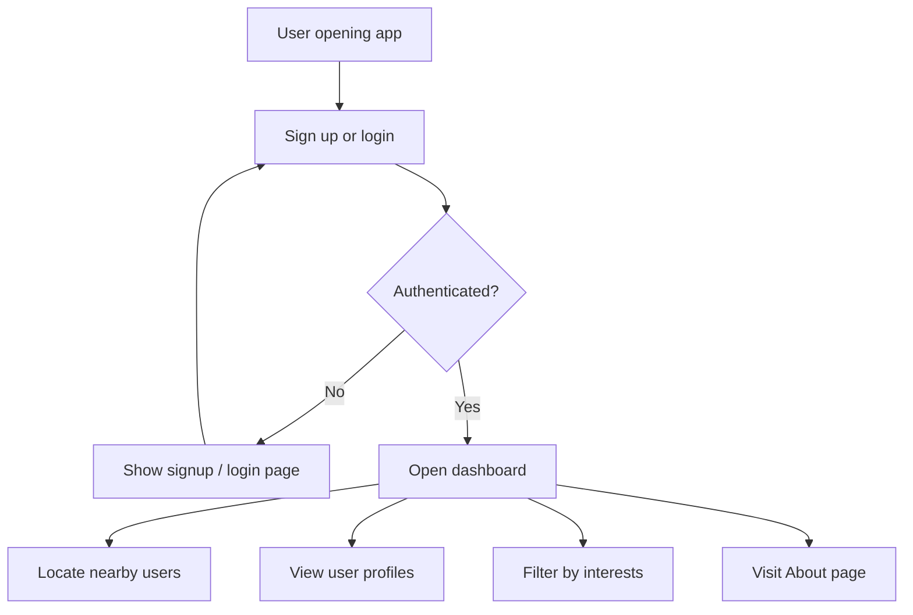

# location-app


## 📖 Project Description

`location-app` is a location-based social discovery prototype that helps users meet and connect with people nearby who share similar interests. The app supports registration, login, map-based discovery, profile browsing, interest filtering, and an About page with the project mission.

## ✨ Features

- User signup and login experience
- Discover nearby users on a responsive map
- View user profiles with interests and personal details
- Filter user list by interest keywords
- Manual city search for location-based discovery
- Dedicated About page describing the app mission
- Local JSON-backed prototype data storage
- Browser `localStorage` for user session state

## 🛠️ Technologies Used

- HTML5
- CSS3
- JavaScript (Vanilla)
- Leaflet.js for interactive maps
- Python
- FastAPI
- Uvicorn
- JSON for prototype data persistence

## 📂 Project Structure

```
location-app/
  README.md
  backend/
    main.py
  data/
    users.json
  frontend/
    index.html
    signup.html
    dashboard.html
    about.html
    profile.html
    app.js
    style.css
```

## ⚙️ Installation & Setup

1. Clone the repository:
   ```bash
   git clone https://github.com/yourusername/location-app.git
   cd location-app
   ```
2. Create a Python virtual environment:
   ```bash
   python -m venv .venv
   .\.venv\Scripts\activate
   ```
3. Install backend dependencies:
   ```bash
   pip install fastapi uvicorn
   ```
4. Ensure `data/users.json` exists and contains valid JSON.

## 🚀 How to Run

### Start the backend server

```bash
uvicorn backend.main:app --reload
```

### Open the frontend

Open `frontend/index.html` directly in your browser or serve the `frontend/` directory with a static server.

## 📸 Screenshot

> Add your own screenshot here once available.


## 🔄 Application Workflow



## 📚 What I Learned

- How to build a small full-stack prototype with FastAPI and vanilla JavaScript
- How to use Leaflet to render an interactive map
- How to store session state with browser `localStorage`
- How to structure a simple frontend application with reusable HTML/CSS patterns

## 🚀 Future Improvements

- Add a real database for persistent user storage
- Support real authentication and password handling
- Add messaging or chat features
- Improve mobile responsiveness and UI polish
- Add dynamic user location updates in real time
- Add more cities and enhanced search capabilities

## 📄 License

This project is released under the `MIT License`.

## 👨‍💻 Author

- Your Name
- GitHub: [yourusername](https://github.com/yourusername)
- Email: your.email@example.com
